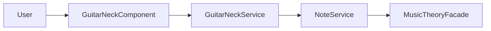
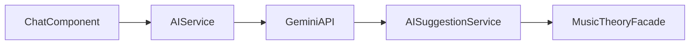

# Guitar Neck UI - Architektura Systemu

## Przegląd Architektury
Aplikacja wykorzystuje architekturę warstwową opartą na wzorcu Facade i Service Pattern, z centralnym zarządzaniem stanem i asynchroniczną komunikacją z API Gemini.

## Główne Komponenty Systemu

### 1. Warstwa Prezentacji
- `HomePageComponent` - główny komponent agregujący interfejs użytkownika
- `GuitarNeckComponent` - interaktywna wizualizacja gryfu gitary
- `ToolboxFormComponent` - kontrolki do wyboru skal i akordów
- `ChatComponent` - interfejs konwersacji z AI
- `AISuggestionsComponent` - wyświetlanie sugestii od AI

### 2. Warstwa Serwisów

#### Core Services
- `MusicTheoryFacadeService` - fasada integrująca logikę muzyczną
- `GuitarNeckService` - zarządzanie stanem gryfu
- `NoteService` - operacje na nutach
- `ScaleAndTriadService` - generowanie skal i akordów

#### AI Services
- `AIService` - komunikacja z Gemini API
- `AISuggestionService` - zarządzanie sugestiami AI
- `ExtendedChordService` - obsługa rozszerzonych akordów

### 3. Model Danych
```typescript
// Główne interfejsy
interface GuitarNote {
  fret: number;
  string: number;
  note: string;
  selected: boolean;
}

interface MusicalSuggestion {
  displayName: string;
  notes: string[];
  type: 'scale' | 'triad' | 'extendedChord';
}

interface AIResponse {
  textResponse: string;
  suggestions: MusicalSuggestion[];
}
```

## Przepływ Danych

### 1. Interakcja z Gryfem


### 2. Przepływ AI


## Integracja z Gemini AI

### Konfiguracja
```typescript
interface AIConfig {
  apiKey: string;
  endpoint: string;
  model: string;
  temperature: number;
  maxTokens: number;
}
```

### Format Odpowiedzi API
```json
{
  "textResponse": "string",
  "suggestions": [{
    "displayName": "string",
    "notes": ["string"],
    "type": "scale|triad|extendedChord"
  }]
}
```

## Wzorce Projektowe

### 1. Facade Pattern
`MusicTheoryFacadeService` ukrywa złożoność operacji muzycznych i zapewnia prosty interfejs dla komponentów UI.

### 2. Command Pattern
Implementacja poleceń UI (`UICommands`) dla różnych operacji na gryfie:
- `DisplayAllNotesCommand`
- `DisplayScaleCommand`
- `DisplayTriadCommand`
- `DisplaySingleNoteCommand`

### 3. Observer Pattern
Wykorzystanie RxJS dla reaktywnego przepływu danych:
- `BehaviorSubject` dla stanu AI
- `Observable` dla asynchronicznych operacji

## Konfiguracja Środowiska

### Development
```typescript
environment = {
  production: false,
  geminiApiKey: 'YOUR_API_KEY'
}
```

### Production
```typescript
environment = {
  production: true,
  geminiApiKey: 'PRODUCTION_API_KEY'
}
```

## Bezpieczeństwo
- Klucz API Gemini przechowywany w zmiennych środowiskowych
- Walidacja danych wejściowych w serwisach
- Obsługa błędów API
- Rate limiting dla zapytań AI

## Skalowalność i Wydajność

### Aktualnie Zaimplementowane
- Podstawowa obsługa błędów API
- Buforowanie odpowiedzi AI
- RxJS do zarządzania strumieniami danych

### Rekomendowane Usprawnienia Wydajnościowe

#### 1. Lazy Loading (Do Implementacji)
```typescript
// Przykład planowanej implementacji lazy loadingu dla modułu AI
const routes: Routes = [
  {
    path: 'ai-chat',
    loadChildren: () => import('./ai/ai.module').then(m => m.AiModule)
  }
];
```

#### 2. Memoizacja (Do Implementacji)
```typescript
// Przykład planowanej implementacji memoizacji dla ScaleAndTriadService
@Injectable()
export class ScaleAndTriadService {
  private scaleCache = new Map<string, GuitarNote[]>();

  generateScale(scaleName: string, rootNote: string): GuitarNote[] {
    const cacheKey = `${scaleName}-${rootNote}`;
    if (this.scaleCache.has(cacheKey)) {
      return this.scaleCache.get(cacheKey)!;
    }
    
    const result = this.calculateScale(scaleName, rootNote);
    this.scaleCache.set(cacheKey, result);
    return result;
  }
}
```

#### 3. Optymalizacja Renderowania (Do Implementacji)
```typescript
// Przykład planowanej implementacji dla GuitarNeckComponent
@Component({
  selector: 'app-guitar-neck',
  changeDetection: ChangeDetectionStrategy.OnPush
})
export class GuitarNeckComponent {
  @Input() notes: GuitarNote[];
  
  // Implementacja trackBy dla ngFor
  trackByFret(index: number, note: GuitarNote): string {
    return `${note.string}-${note.fret}`;
  }
}
```

#### 4. Monitoring Wydajności (Do Implementacji)
```typescript
// Przykład planowanej implementacji monitoringu AI
@Injectable()
export class AIPerformanceService {
  private responseTimeLog = new BehaviorSubject<number[]>([]);

  logResponseTime(startTime: number, endTime: number) {
    const duration = endTime - startTime;
    const currentLog = this.responseTimeLog.value;
    this.responseTimeLog.next([...currentLog, duration]);
  }

  getAverageResponseTime(): number {
    const times = this.responseTimeLog.value;
    return times.reduce((a, b) => a + b, 0) / times.length;
  }
}
```

### Plan Implementacji

1. Priorytet Wysoki:
   - Implementacja lazy loadingu dla modułu AI
   - Podstawowa memoizacja dla często używanych skal i akordów

2. Priorytet Średni:
   - Optymalizacja renderowania komponentu gryfu
   - Implementacja mechanizmu cache'owania

3. Priorytet Niski:
   - System monitorowania wydajności
   - Zaawansowane techniki optymalizacji

### Obecne Ograniczenia
- Wszystkie moduły ładowane są eagerly
- Brak cache'owania wyników muzycznych
- Podstawowe mechanizmy detekcji zmian Angular
- Ograniczony monitoring wydajności

### Metryki Wydajności do Śledzenia
- Czas ładowania początkowego
- Czas odpowiedzi API Gemini
- Zużycie pamięci przy renderowaniu gryfu
- Czas generowania skal i akordów

## Monitorowanie i Debugowanie
- Angular DevTools
- Console logging dla krytycznych operacji
- Error tracking w serwisach
- Performance monitoring dla operacji AI
